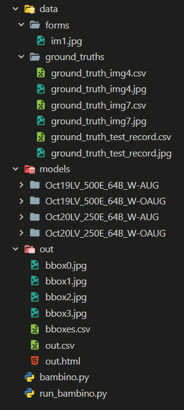

# Bambino

### Overall Information
Bambino is a birth record handwriting box extraction tool.

This program provides a framework for extracting desired handwriting boxes
from ancient italian birth records. The program functions by classifying 
handwriting boxes by classifying their preceding keywords based on 
geometric positioning.

This project is part of our coursework for Fort Lewis College's **CE315 Junior Design and Practice** course.

### Collaborators
- Eric Hill - [GitHub](https://github.com/EricJHill)
- Anders Ladow - [GitHub](https://github.com/amladow)
- Lincoln Scheer - [GitHub](https://github.com/BikeLinc)
- Lucien Verrone - [GitHub](https://github.com/lucienverrone)

### Typical Usage
```python
# Import Bambino
from bambino import Bambino

# Startup Framework w/ Record Images, Form Ground Truths and Desired Model
record_image_path = ["data/forms/im1.jpg"]
ground_truth_csv = "data/ground_truths/ground_truth_img4.csv"
model_path = "models/Oct19LV_500E_64B_W-AUG/detect/train2/weights/best.pt"

# Overlap Percent Threshold
overlap_threshold = 15

# Run Bambino
bambi = Bambino(record_images=record_image_path, ground_truth_csv=ground_truth_csv, model_path=model_path)
bambi.run(overlap_threshold) # Returns out.html
```

### Folder Layout


### Virtual Spreadsheet Examples
#### Example 1
[Virtual Spreadsheet](https://htmlpreview.github.io/?https://github.com/BikeLinc/CE315-Junior-Design/blob/build/out1/out.html)

[Image](https://github.com/BikeLinc/CE315-Junior-Design/blob/build/data/forms/record_example.jpg)
#### Example 2
[Virtual Spreadsheet](https://htmlpreview.github.io/?https://github.com/BikeLinc/CE315-Junior-Design/blob/build/out/out.html)

[Image](https://github.com/BikeLinc/CE315-Junior-Design/blob/build/data/forms/im1.jpg)


